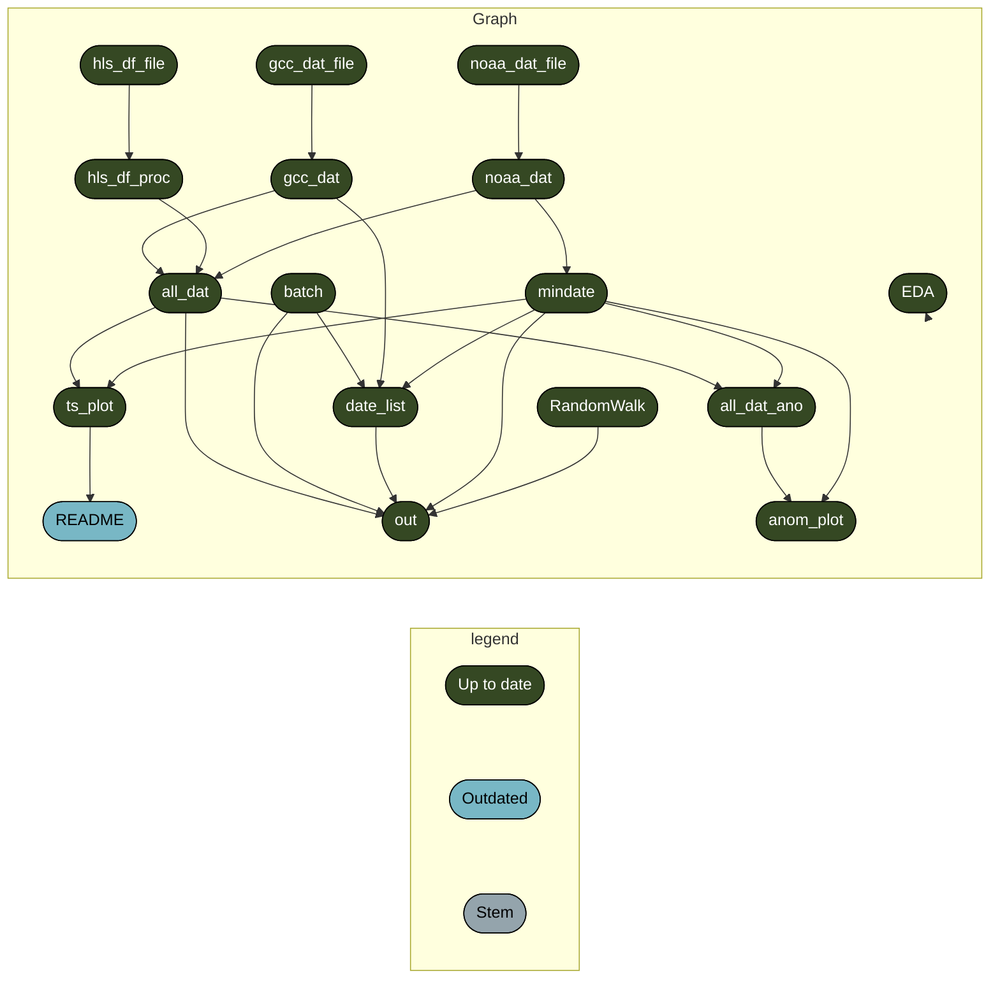
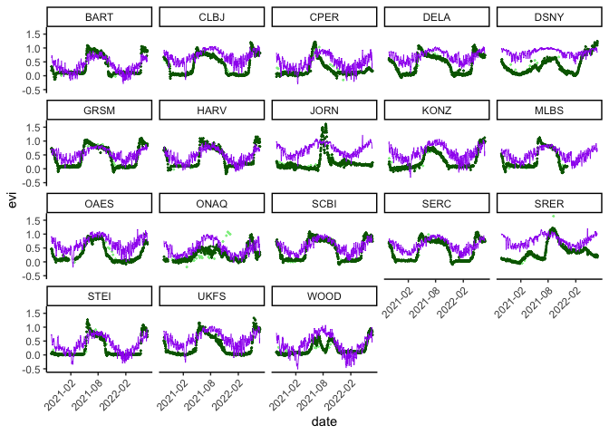

<!-- README.md is generated from README.Rmd. Please edit that file -->

# efi-2022-phenocam

<!-- badges: start -->
<!-- badges: end -->

### Workflow:

── Attaching packages ─────────────────────────────────────── tidyverse
1.3.1 ── ✔ ggplot2 3.3.6 ✔ purrr 0.3.4 ✔ tibble 3.1.7 ✔ dplyr 1.0.9 ✔
tidyr 1.2.0 ✔ stringr 1.4.0 ✔ readr 2.1.2 ✔ forcats 0.5.1 ── Conflicts
────────────────────────────────────────── tidyverse_conflicts() ── ✖
dplyr::filter() masks stats::filter() ✖ dplyr::lag() masks stats::lag()
Loading required package: coda Linked to JAGS 4.3.1 Loaded modules:
basemod,bugs



# Target data

gcc data is here:

``` r
gcc_dat <- 
  readr::read_csv(
    "https://data.ecoforecast.org/targets/phenology/phenology-targets.csv.gz",
    guess_max = 1e6
  )
```

site metadata is here:

``` r
site_data <- 
  readr::read_csv(
    "https://raw.githubusercontent.com/eco4cast/neon4cast-phenology/master/Phenology_NEON_Field_Site_Metadata_20210928.csv"
    )
```

[Data exploration](docs/EDA.md)

# Timeseries

``` r
tar_read(ts_plot)
#> Warning: Removed 11245 rows containing missing values (geom_point).
#> Warning: Removed 342 rows containing missing values (geom_point).
#> Warning: Removed 2 row(s) containing missing values (geom_path).
```

<!-- -->

# Model structure

Data model

")

")

Process model

")

")

")

Priors

")

")

")

")

# Forecasts

Some examples

-   [2020-11-24](forecasts/2020-11-24/plot.pdf)

# Links

-   [challenge
    docs](https://projects.ecoforecast.org/neon4cast-docs/theme-phenology.html)
-   [phenocam](https://phenocam.sr.unh.edu/webcam/)

# Repo structure

-   `data/` put raw data here
-   `R/` put R functions to be `source()`ed here
-   `docs/` put .Rmd files to be rendered here
