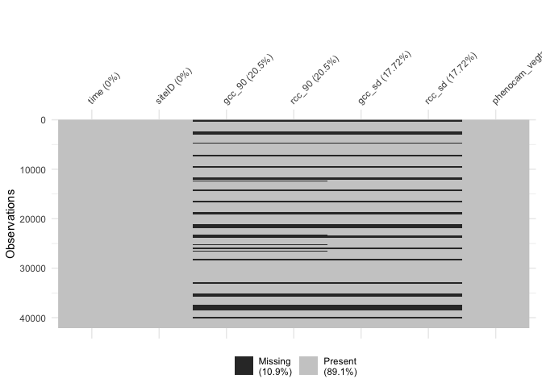
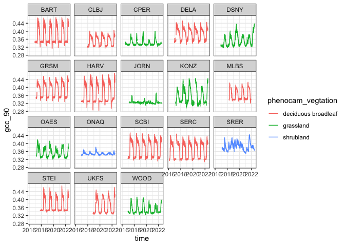
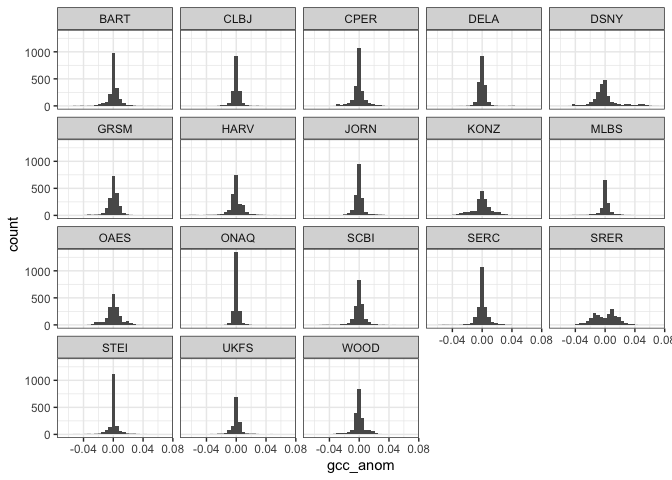

Exploratory Data Analysis
================
Eric R. Scott
2022-06-28

``` r
library(tidyverse)
```

    ## ── Attaching packages ─────────────────────────────────────── tidyverse 1.3.1 ──

    ## ✔ ggplot2 3.3.6     ✔ purrr   0.3.4
    ## ✔ tibble  3.1.7     ✔ dplyr   1.0.9
    ## ✔ tidyr   1.2.0     ✔ stringr 1.4.0
    ## ✔ readr   2.1.2     ✔ forcats 0.5.1

    ## ── Conflicts ────────────────────────────────────────── tidyverse_conflicts() ──
    ## ✖ dplyr::filter() masks stats::filter()
    ## ✖ dplyr::lag()    masks stats::lag()

``` r
library(skimr)
library(visdat)
library(lubridate)
```

    ## 
    ## Attaching package: 'lubridate'

    ## The following objects are masked from 'package:base':
    ## 
    ##     date, intersect, setdiff, union

``` r
theme_set(theme_bw())
```

# Read in data

``` r
gcc_dat <- 
  readr::read_csv(
    "https://data.ecoforecast.org/targets/phenology/phenology-targets.csv.gz",
    guess_max = 1e6
  )
```

    ## Rows: 42120 Columns: 6
    ## ── Column specification ────────────────────────────────────────────────────────
    ## Delimiter: ","
    ## chr  (1): siteID
    ## dbl  (4): gcc_90, rcc_90, gcc_sd, rcc_sd
    ## date (1): time
    ## 
    ## ℹ Use `spec()` to retrieve the full column specification for this data.
    ## ℹ Specify the column types or set `show_col_types = FALSE` to quiet this message.

``` r
site_data <- 
  readr::read_csv(
    "https://raw.githubusercontent.com/eco4cast/neon4cast-phenology/master/Phenology_NEON_Field_Site_Metadata_20210928.csv"
    )
```

    ## Rows: 18 Columns: 49
    ## ── Column specification ────────────────────────────────────────────────────────
    ## Delimiter: ","
    ## chr (31): field_domain_id, field_site_id, field_site_name, phenocam_code, ph...
    ## dbl (12): field_latitude, field_longitude, field_utm_northing, field_utm_eas...
    ## lgl  (6): field_site_subtype, field_usgs_huc, field_watershed_name, field_wa...
    ## 
    ## ℹ Use `spec()` to retrieve the full column specification for this data.
    ## ℹ Specify the column types or set `show_col_types = FALSE` to quiet this message.

``` r
gcc_dat <- full_join(gcc_dat, site_data |> select(siteID = field_site_id, phenocam_vegtation))
```

    ## Joining, by = "siteID"

# Skim data

``` r
skim(gcc_dat)
```

|                                                  |         |
|:-------------------------------------------------|:--------|
| Name                                             | gcc_dat |
| Number of rows                                   | 42120   |
| Number of columns                                | 7       |
| \_\_\_\_\_\_\_\_\_\_\_\_\_\_\_\_\_\_\_\_\_\_\_   |         |
| Column type frequency:                           |         |
| character                                        | 2       |
| Date                                             | 1       |
| numeric                                          | 4       |
| \_\_\_\_\_\_\_\_\_\_\_\_\_\_\_\_\_\_\_\_\_\_\_\_ |         |
| Group variables                                  | None    |

Data summary

**Variable type: character**

| skim_variable      | n_missing | complete_rate | min | max | empty | n_unique | whitespace |
|:-------------------|----------:|--------------:|----:|----:|------:|---------:|-----------:|
| siteID             |         0 |             1 |   4 |   4 |     0 |       18 |          0 |
| phenocam_vegtation |         0 |             1 |   9 |  19 |     0 |        3 |          0 |

**Variable type: Date**

| skim_variable | n_missing | complete_rate | min        | max        | median     | n_unique |
|:--------------|----------:|--------------:|:-----------|:-----------|:-----------|---------:|
| time          |         0 |             1 | 2016-01-29 | 2022-06-25 | 2019-04-12 |     2340 |

**Variable type: numeric**

| skim_variable | n_missing | complete_rate | mean |   sd |   p0 |  p25 |  p50 |  p75 | p100 | hist  |
|:--------------|----------:|--------------:|-----:|-----:|-----:|-----:|-----:|-----:|-----:|:------|
| gcc_90        |      8633 |          0.80 | 0.36 | 0.04 | 0.28 | 0.33 | 0.35 | 0.39 | 0.47 | ▁▇▃▃▁ |
| rcc_90        |      8633 |          0.80 | 0.42 | 0.04 | 0.30 | 0.39 | 0.42 | 0.45 | 0.60 | ▁▇▇▁▁ |
| gcc_sd        |      7464 |          0.82 | 0.00 | 0.00 | 0.00 | 0.00 | 0.00 | 0.00 | 0.01 | ▇▇▂▁▂ |
| rcc_sd        |      7464 |          0.82 | 0.01 | 0.01 | 0.00 | 0.01 | 0.01 | 0.02 | 0.03 | ▆▇▂▆▃ |

# Missingness

``` r
vis_miss(gcc_dat)
```

    ## Warning: `gather_()` was deprecated in tidyr 1.2.0.
    ## Please use `gather()` instead.
    ## This warning is displayed once every 8 hours.
    ## Call `lifecycle::last_lifecycle_warnings()` to see where this warning was generated.

<!-- -->

``` r
## if you want to see missingness by site:
# gcc_dat |> group_by(siteID) |> group_split() |> map(vis_miss)
```

Weird that standard deviations aren’t always missing when data is
missing

# Plot data

## Time Series of GCC

``` r
ggplot(gcc_dat, aes(x = time, y = gcc_90, color = phenocam_vegtation)) +
  geom_line() +
  facet_wrap(~siteID)
```

    ## Warning: Removed 797 row(s) containing missing values (geom_path).

<!-- -->

## Histograms of GCC anomalies

Anomalies calculated by site and day of year

``` r
gcc_dat |>
  mutate(doy = yday(time)) |> 
  #within each site and for each day of year...
  group_by(doy, siteID) |> 
  #...calculate mean GCC for the whole time series...
  mutate(mean_gcc_doy = mean(gcc_90, na.rm = TRUE)) |> 
  ungroup() |> 
  # ... then calculate GCC anomaly
  mutate(gcc_anom  = gcc_90 - mean_gcc_doy) |> 
  #and plot!
  ggplot() +
  geom_histogram(aes(gcc_anom)) +
  facet_wrap(~siteID)
```

    ## `stat_bin()` using `bins = 30`. Pick better value with `binwidth`.

    ## Warning: Removed 8633 rows containing non-finite values (stat_bin).

<!-- -->

JORN looks really dry


SRER also looks pretty dry


